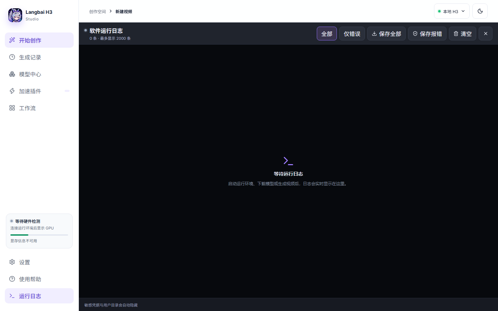
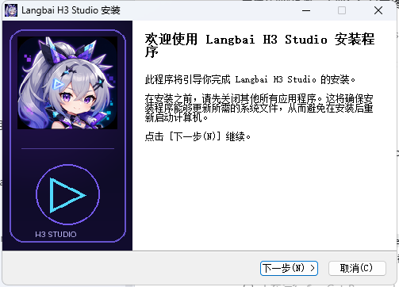

# Langbai H3 Studio

面向 Windows NVIDIA 用户的 MiniMax-H3 视频生成桌面软件。它用简洁的中文创作表单代替 ComfyUI 节点画布，同时保留本地模型、外接 ComfyUI、远程 GPU、AutoDL、社区加速插件和 MiniMax 云端 API。

> 当前为 Preview。项目代码使用 Apache-2.0；银狼·狼尊主题图像属于非官方同人二次创作资产，许可边界见 [`app/src/assets/README.md`](app/src/assets/README.md)。

## v0.11.0：全运行日志与中文品牌安装器

- 参考 ComfyUI 的诊断布局，新增软件内置黑色日志终端
- 汇总运行环境、下载、模型、插件、生成、AutoDL、远程 GPU、更新和路径状态
- 实时捕获托管 ComfyUI 的 stdout/stderr，不弹出外部 CMD 窗口
- 本次会话完整日志写入本地 JSONL，界面显示最近 2000 条
- 可由用户选择位置保存全部日志或仅错误记录
- 自动隐藏 Windows 用户目录以及常见 API Key、Token、Bearer 凭据
- Windows Setup 强制简体中文，并使用原版银狼头像图标、狼尊主题侧栏和页眉
- 新安装时可以选择软件安装目录；默认按当前 Windows 用户安装，不要求管理员权限





## 下载

Windows x64 Preview：[`Langbai-H3-Studio_0.11.0_x64-setup.exe`](release/v0.11.0/Langbai-H3-Studio_0.11.0_x64-setup.exe)

SHA-256：`2BFFB13696ECDBE4BA097CC275848AC9D037C6FAECFA61CF41D30FB7CB2280FD`

安装包目前没有商业代码签名，Windows 可能显示“未知发布者”。请核对 GitHub Release 与仓库公布的 SHA-256。

## 核心能力

### 新手创作

- 文字生成视频
- 首帧／尾帧生成视频
- 图片、视频、音频和文字的全模态参考生成
- 简体中文参数说明、提示词示例和推荐预设
- 生成历史、设置复用和错误记录

### 本地运行

- 软件内置并管理独立 ComfyUI Runtime
- 也可连接用户已有的本地 ComfyUI
- 自动检测 MiniMax-H3 必需节点、模型和运行状态
- 托管 ComfyUI 只监听 `127.0.0.1`
- 支持实验性的 8–10GB 极低显存档

### 模型管理

- 软件内下载官方固定版本模型
- 显示文件名、进度、速度和预计剩余时间
- Range 断点续传、SHA-256 校验和原子替换
- 扫描并关联用户已经下载的本地模型
- FL2VA 与 Ref2VA 共享编码器和 VAE 文件

### 保存位置

- 默认保存到软件可执行文件同级的 `output` 目录
- 可以设置固定的自定义默认目录
- 可以选择每次生成前询问保存位置

### 加速插件

- KJNodes `MiniMaxH3MemoryEfficientSageAttentionPatch` 可真实插入 H3 API Graph
- FunPack 作为社区兼容扩展托管，不宣称具有加速效果
- 支持声明式 `.h3plugin` 适配包的检查、安装、启停和卸载
- 未经 MiniMax-H3 兼容验证的 GGUF、TeaCache、通用 FlashAttention 不会标记为可用

### AutoDL 与远程 GPU

- 粘贴 AutoDL SSH 命令并解析主机、用户和端口
- 严格校验 `known_hosts`，使用 Windows OpenSSH 隧道连接远端 ComfyUI
- 检测远端 GPU、显存、内存、磁盘、Python、ComfyUI、H3 模型和 KJNodes
- 使用 `/workspace/LangbaiH3Studio` 隔离目录，不覆盖市场镜像内容
- 后台下载模型，支持进度恢复、取消、断点续传和精确回滚

### 更新与诊断

- 从本项目 GitHub Releases 检查 Preview 更新
- 软件内下载 Setup，完成 SHA-256 验证后启动更新
- 本机兼容性记录包含硬件、采样观察资源、生成耗时和插件组合
- 可导出匿名基准 JSON，不包含提示词、素材、路径、ComfyUI 地址、任务 ID 或错误详情

## 硬件边界

- 16–24GB NVIDIA 单卡是当前主要设计基准
- 8–10GB 档依赖 CPU 卸载、较低分辨率和社区优化，目前仍是实验目标
- RTX 5090 和 AutoDL 方案已具备连接、部署和记录链路，但真实 MiniMax-H3 性能矩阵仍需对应硬件
- 模型体积、内存消耗和插件收益必须以真实生成报告为准

## 本地开发

```powershell
cd app
npm install
npm run dev
```

前端构建：

```powershell
cd app
npm run build
```

Windows Setup 需要在 Visual Studio x64 Developer Command Prompt 中构建：

```powershell
cd app
npm run desktop:build
```

## 文档

- [产品需求](docs/PRD.md)
- [技术架构](docs/ARCHITECTURE.md)
- [H3 API Graph](docs/H3_API_GRAPH_SPEC.md)
- [H3 Runtime 兼容性](docs/H3_RUNTIME_COMPATIBILITY.md)
- [8GB 实验档](docs/H3_8GB_EXPERIMENT.md)
- [远程 GPU](docs/REMOTE_GPU.md)
- [AutoDL 隔离部署](docs/AUTODL_DEPLOYMENT.md)
- [加速兼容性](docs/ACCELERATION_COMPATIBILITY.md)
- [社区插件规范](docs/PLUGIN_SPEC.md)
- [设计系统](design-system/langbai-h3-studio/MASTER.md)

## 许可证

代码许可证：[Apache-2.0](LICENSE)。第三方模型、节点、角色形象和其他资产继续遵循各自许可证与权利人的规则。
