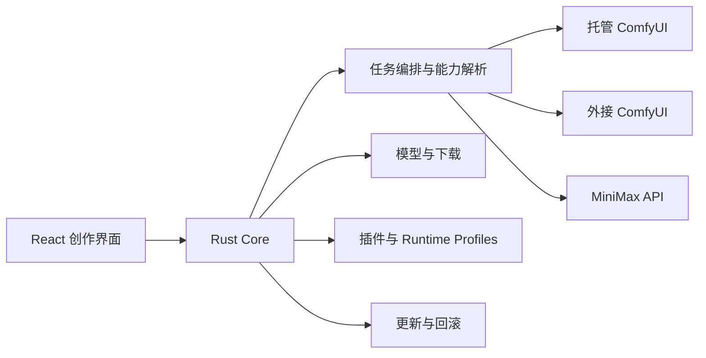

# 技术架构

## 技术栈

- Tauri 2＋React＋TypeScript
- Rust Core（下载、哈希、进程监管、更新、凭据、文件系统）
- 固定版本 Python＋ComfyUI Runtime
- SQLite（任务/模型/插件/下载）与 Windows Credential Manager（密钥）
- FFmpeg/ffprobe（仅 argv 调用）

## 分层



UI 只提交语义化 `GenerateRequest`，后端适配器编译为工作流。

```ts
interface BackendAdapter {
  probe(): Promise<BackendProbe>
  capabilities(): Promise<CapabilitySet>
  validate(request: GenerateRequest): Promise<ValidationIssue[]>
  plan(request: GenerateRequest): Promise<ExecutionPlan>
  submit(plan: ExecutionPlan): Promise<JobHandle>
  events(jobId: string): AsyncIterable<JobEvent>
  cancel(jobId: string): Promise<void>
  recover(jobId: string): Promise<JobSnapshot>
}
```

## ComfyUI

托管运行时放在 `%LOCALAPPDATA%\LangbaiH3Studio\runtime\comfy\<version>`，模型与运行时分离并用 `extra_model_paths.yaml` 共享。仅监听 `127.0.0.1` 随机端口；更新先进入 staging，自检后原子切换并保留上一版。

外接实例默认只读探测 API、WebSocket、版本和节点。素材经 API 上传，输出下载至 Studio 的本机目录；不把远端路径误作本机路径。

## 任务、模型与下载

任务保存请求、解析计划、工作流哈希、后端指纹、精确模型/插件版本、prompt_id 与输出。重启后和后端队列/history 对账。

下载状态机：`queued → resolving → downloading → verifying → installing → ready`。使用 Range、`.part`、ETag sidecar、EMA 速度、SHA-256 与目标卷原子安装；HF revision 固定 commit hash。本地大模型默认映射而非复制。

## 发布更新

首版 per-user Setup，应用、Runtime 和模型数据分离。GitHub Release manifest 包含版本、资产、SHA-256、大小、说明和 Ed25519 签名。独立 updater 替换文件，健康检查失败时回滚。

## 许可证风险

Apache-2.0 只覆盖 Studio 自有代码。ComfyUI、自定义节点、FFmpeg、模型和插件分别受其许可证约束，打包前必须生成 Third-Party Notices 并核对组合分发义务。
